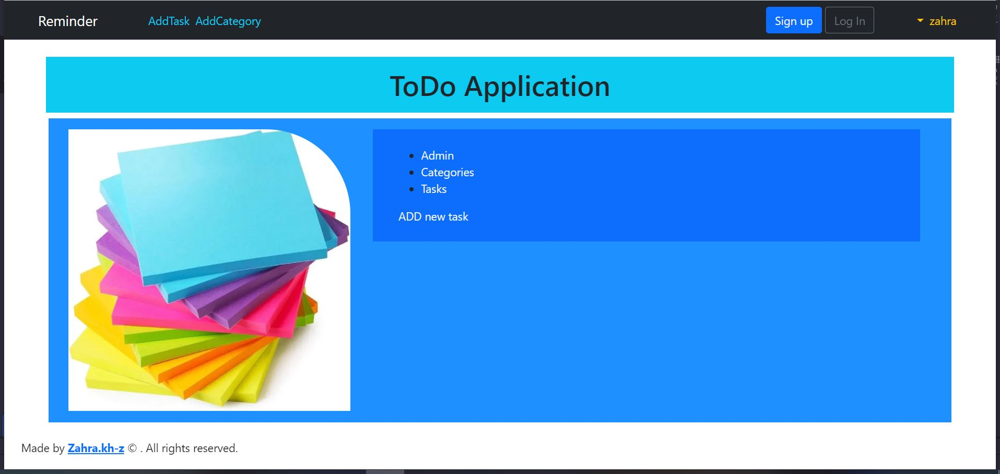

# Reminder
This code suggest by Zahra Khalifeh-Zadeh for Reminder Mini_project_django. at maktab51 python course

*Created on 1400-05-06

The following items have been used in this project:

widgets for datetime

ImageField for picture

dataTables for show data in table format

iziToast for show message

rest-framework for api, serializer

slug, forms, crispy, views.generic, APIView, ...

